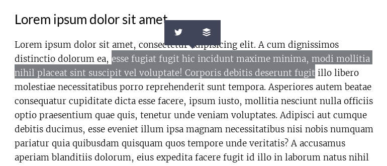

# ShareSelectedText.js
*share selected text on twitter, buffer, and some others. Inspired by [medium.com](https://medium.com)*



I made this small javascript library for [my personal blog](http://vincent-loy.fr), the existing 
libraries doesn't fit my needs, so I created that one.

ShareSelectedText.js currently support the following social medias & services:
- twitter
- buffer
- reddit
- stumbleupon
- tumblr
- digg
- linkedin
- facebook

*You can open an issue or follow [the contribution guidelines](#contribution-guidelines) if you want to add another service or social media*

## Getting started

Add the CSS file (you have to put the `dist/fonts` directory and the `shareSelectedText.min.css` file in the same directory)
```html
<link rel="stylesheet" href="dist/shareSelectedText.min.css"/>
```

Add the Javascript file before `body` HTML closing tag.
```html
<script src="dist/shareSelectedText.js"></script>
```

Then, you can init the plugin :
```javascript
// plugin initialization with default options
shareSelectedText('.my-super-selector', {
    tooltipClass: '',    // cool, if you want to customize the tooltip
    sanitize: true,      // will sanitize the user selection to respect the Twitter Max length (recommended) 
    buttons: [           // services that you want to enable you can add : 
        'twitter',       // - twitter, tumblr, buffer, stumbleupon, digg, reddit, linkedin, facebook
        'buffer'
    ],
    anchorsClass: '',    // class given to each tooltip's links
    twitterUsername: '', // for twitter widget, will add 'via @twitterUsername' at the end of the tweet.
    facebookAppID: '', // Can also be an HTML element inside the <head> tag of your page : <meta property="fb:APP_ID" content="YOUR_APP_ID"/>
    facebookDisplayMode: 'popup', //can be 'popup' || 'page'
    tooltipTimeout: 250  //Timeout before that the tooltip appear in ms
});
```

## Other Builds
- Ruby on Rails engine: [share-selected-text_rails](https://github.com/WendyBeth/share-selected-text_rails) by [@WendyBeth](https://github.com/WendyBeth)

## Contribution Guidelines
To contribute please consider to respect the following rules:
- Work in a different branch, well named, based on current `develop` branch (I personally use [git-flow](http://danielkummer.github.io/git-flow-cheatsheet/)).
- respect the `.erLintrc` rules.
- If you add a new social media or service: 
    - add the service or social media SVG icon in dev/icons
    - compile the font using [fontcustom](https://github.com/FontCustom/fontcustom) install fontcustom the run `fontcustom compile` in the icons directory, the run `gulp build:copy:fonts` in project root directory.
    - Don't forget to add service's name and url.
- small changes are better than huge changes.

And don't forget that you are awesome!

## Changelog
- v1.1.1
    - Make tooltip not clickable when not active (@DustinArmstrong)
    
- v1.1.0
    - Add Facebook support (Thanks to [@WendyBeth](https://github.com/WendyBeth))

- v1.0.0
    - initial release

- v1.0.1
    - avoid font icons name conflicts by adding sst- prefix
